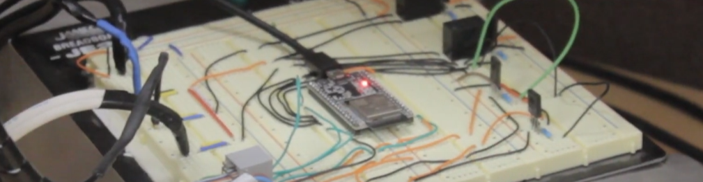

# Water Metering Solution 💦 - [Demonstration video][youtube] 👋 

[][youtube]

## 🔭 Abstract

In this project we address a problem that touches parts of citizens about the correctness of their water bills. Many people complained that their bill does not match their consumption.  Some people published video clips that indicated that the water meter is counting while no water flows coming from the company water pipe, just air flow! Air can enter the water lines in many ways, and it can lead to a wrong reading in the homeowner’s water meter. Houses in higher land levels suffers more than houses in lower land levels. That motivated us to deeply study the problem. We came with the innovation of a custom sensor that measures both air and water flows and the percentage of each one. Using the custom sensor, one can numerically check whether there is an air flow in the pipe or not. As a proof of concept, we have designed and implemented an embedded system (based on ESP32) prototype for our custom sensor. Using water and air pumps, we additionally designed and implemented a physical system to mimic real home water lines with air flow.  We tested our system in different scenarios, such as: pure water flow, pure air flow, 50% air flow and other percentages. We found that our innovated meter can detect the percentages of water/air in the lines. In the real water lines supply, we noted that the air flow percentage is not constant. When pumping starts, the air flow (in a suffering house) is in its maximum level and start decaying until it becomes zero. Our final system comes with an electrical water valve and it is installed in the ground water tank of a house. The system periodically measures the air flow percentage in the water lines, if it is greater than certain threshold it closes the electrical water valve and then reopen at the start of a new period. 

### Connect with me:

[][youtubeChannelW]
[][youtubeChannelD]
&nbsp;&nbsp;
[][twitterW]
[][twitterD]
&nbsp;&nbsp;
[][linkedinW]
[][linkedinD]

### Languages and Tools:

[][samepage]
[][samepage]
[][samepage]
[][samepage]
[][samepage]
[][samepage]
[][samepageD]
[][samepageW]
[][samepageW]
[][samepageD]

 
 

[youtube]: https://www.youtube.com/watch?v=ksbPfUVpSi8
[youtubeChannelW]: https://www.youtube.com/channel/UCVIea0-0IT5Hl7DjlnI-ssQ#gh-light-mode-only
[youtubeChannelD]: https://www.youtube.com/channel/UCVIea0-0IT5Hl7DjlnI-ssQ#gh-dark-mode-only
[twitterW]: https://twitter.com/aziiz_user#gh-light-mode-only
[twitterD]: https://twitter.com/aziiz_user#gh-dark-mode-only
[linkedinW]: https://www.linkedin.com/in/abdulaziz-alminqah-3354a522a#gh-light-mode-only
[linkedinD]: https://www.linkedin.com/in/abdulaziz-alminqah-3354a522a#gh-dark-mode-only
[samepage]: https://github.com/AziizMq/myProject
[samepageW]: https://github.com/AziizMq/myProject#gh-light-mode-only
[samepageD]: https://github.com/AziizMq/myProject#gh-dark-mode-only